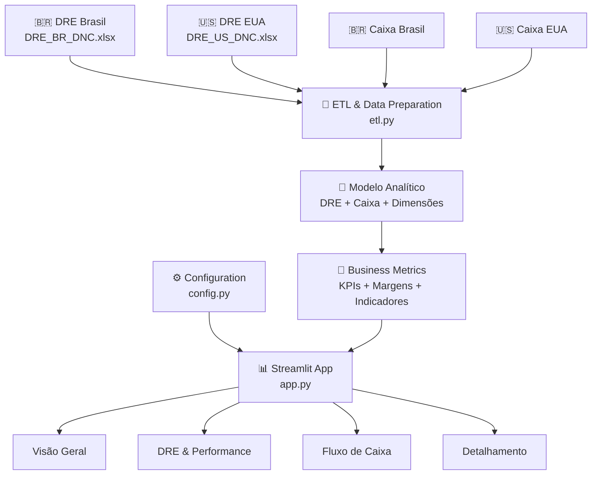

<div align="center">

# 📊 Dashboard DRE · SG Global Group

### **Inteligência Financeira para Decisão**

**Brasil 🇧🇷 · EUA 🇺🇸**

Transformando dados financeiros brutos em indicadores claros, comparáveis e acionáveis.

<br>

[](https://www.python.org/)
[](https://pandas.pydata.org/)
[](https://streamlit.io/)
[](https://plotly.com/python/)
[]()

<br>

**Projeto I · Escola de Dados · DNC**

</div>

---

## 🎯 Visão executiva

O **Dashboard DRE — SG Global Group** é uma solução de análise financeira desenvolvida para transformar duas bases de dados — **Brasil** e **EUA** — em uma visão executiva da **Demonstração do Resultado do Exercício (DRE)** e do **Fluxo de Caixa**.

A aplicação combina **ETL, tratamento de dados, regras de negócio, indicadores financeiros e visualização interativa** em uma única experiência analítica.

> **Objetivo:** reduzir a distância entre o dado bruto e a decisão gerencial.

### 🌎 Mercados oficiais da interface

| Mercado | Moeda | Uso na análise |
|:---:|:---:|:---|
| 🇧🇷 **Brasil** | **R$** | Operação brasileira |
| 🇺🇸 **EUA** | **US$** | Operação americana |

**Importante:** a aplicação preserva as moedas originais. Não existe conversão cambial automática. Por isso, comparações entre os mercados priorizam **margens, crescimento e indicadores relativos**, evitando comparar valores nominais em moedas diferentes como se fossem equivalentes.

---

## ✨ O que o dashboard entrega

### 💰 DRE & Performance

- Receita Bruta
- Devoluções
- Receita Líquida
- Custos Variáveis
- Custos Fixos
- Despesas Fixas
- Despesas Variáveis
- Impostos
- Resultado Operacional
- Resultado Líquido
- Margem Operacional
- Margem Líquida
- Margem de Contribuição
- **EBITDA (proxy)**

### 🏦 Fluxo de Caixa

- Entradas
- Saídas
- Net Cash
- Saldo Final
- Burn Rate médio
- Runway estimado
- Evolução mensal do caixa

### 🔎 Exploração analítica

- Filtro por empresa
- Filtro por período
- Evolução mensal
- Composição de custos e despesas
- Detalhamento dos lançamentos
- Insights executivos
- Interface responsiva

---

## 🧠 Diferencial técnico

Este projeto não foi construído apenas para **"mostrar gráficos"**.

A arquitetura foi pensada para representar o fluxo completo de uma solução analítica:

```text
             DADOS BRUTOS
                  │
       ┌──────────┴──────────┐
       │                     │
   🇧🇷 Brasil             🇺🇸 EUA
       │                     │
       └──────────┬──────────┘
                  ▼
             🧹 ETL
        Limpeza + Padronização
                  │
                  ▼
          🧩 Modelo Analítico
       Grupo DRE + Dimensões
                  │
                  ▼
          🧮 Business Metrics
       KPIs + Margens + Caixa
                  │
                  ▼
          📊 VISUALIZAÇÃO
         Streamlit + Plotly
                  │
                  ▼
          🎯 DECISÃO GERENCIAL
```

Essa abordagem demonstra competências em **Python, Pandas, ETL, análise financeira, visualização e pensamento orientado à decisão**.

---

## 🏗 Arquitetura



### 🧱 Camadas do projeto

#### `etl.py` · Dados & regras de negócio

Responsável por:

- leitura das planilhas;
- seleção das colunas relevantes;
- limpeza de datas e valores;
- padronização das classificações;
- criação do `Grupo DRE`;
- criação das dimensões temporais;
- cálculo dos KPIs;
- preparação das séries de fluxo de caixa.

#### `config.py` · Configuração central

Mantém a identidade dos mercados em um único ponto:

```python
Brasil → BR → R$
EUA    → US → US$
```

A nomenclatura oficial exibida ao usuário é **Brasil** e **EUA**.

#### `app.py` · Experiência analítica

Responsável por:

- interface Streamlit;
- filtros;
- cards executivos;
- gráficos Plotly;
- indicadores;
- insights;
- navegação;
- responsividade.

---

## 📁 Estrutura do projeto

```text
dashboard_dre_sg_global/
│
├── app.py                    # Aplicação Streamlit
├── etl.py                    # ETL, padronização e métricas
├── config.py                 # Configuração de Brasil, EUA e moedas
├── gerar_graficos.py         # Scripts auxiliares de visualização
├── requirements.txt          # Dependências Python
├── README.md                 # Documentação
│
├── data/
│   ├── DRE_BR_DNC.xlsx       # Base Brasil
│   └── DRE_US_DNC.xlsx       # Base EUA
│
└── docs/
    └── screenshots/          # Imagens da documentação
```

---

## 📈 Indicadores financeiros

| Indicador | Cálculo / conceito |
|---|---|
| **Receita Bruta** | Soma das receitas classificadas na base |
| **Devoluções** | Valores classificados como devolução |
| **Receita Líquida** | Receita Bruta − Devoluções |
| **Custos** | Custos Variáveis + Custos Fixos |
| **Despesas** | Despesas Fixas + Despesas Variáveis |
| **Resultado Operacional** | Receita Líquida − Custos − Despesas |
| **Resultado Líquido** | Resultado Operacional − Impostos |
| **Margem Operacional** | Resultado Operacional / Receita Líquida |
| **Margem de Contribuição** | (Receita Líquida − Custos Variáveis) / Receita Líquida |
| **Margem Líquida** | Resultado Líquido / Receita Líquida |
| **EBITDA (proxy)** | Estimativa operacional baseada nas categorias disponíveis |
| **Net Cash** | Entradas − Saídas |
| **Burn Rate** | Média do consumo de caixa nos períodos negativos |
| **Runway** | Saldo Atual / Burn Rate médio |

### ⚠️ Transparência sobre o EBITDA

A base fornecida não apresenta todas as informações necessárias para calcular um EBITDA contábil estrito, especialmente depreciação e amortização.

Por isso, o dashboard utiliza deliberadamente a nomenclatura **EBITDA (proxy)**.

> **Princípio:** quando os dados não suportam uma conclusão confiável, a aplicação deve sinalizar a limitação em vez de criar falsa precisão.

---

## 🧹 Qualidade dos dados

A etapa de preparação não depende cegamente das fórmulas existentes nas planilhas.

O processo realiza:

- seleção das colunas necessárias;
- tratamento de datas inválidas;
- conversão dos valores financeiros para numérico;
- tratamento de valores ausentes;
- padronização de classificações;
- criação de uma taxonomia comum para Brasil e EUA;
- geração das dimensões `Ano`, `Mes` e `AnoMes`;
- identificação de ausência de movimentação real no caixa.

### Limitações conhecidas

| Situação | Tratamento |
|---|---|
| 🇧🇷 Caixa Brasil sem movimentação suficiente | Burn Rate e Runway não são tratados como indicadores confiáveis |
| Squad sem variação significativa | Não gerar conclusões artificiais por equipe |
| Orçado sem dados suficientes | Comparação Orçado × Realizado permanece limitada |
| Despesas possivelmente incompletas | Margens elevadas devem ser interpretadas com cautela |
| Moedas diferentes | Valores permanecem em R$ e US$; comparação nominal direta é evitada |

---

## 🎨 Princípios de UX

A experiência visual segue uma abordagem **executiva, limpa e orientada à leitura rápida**:

- hierarquia visual clara;
- KPIs destacados antes dos gráficos;
- Brasil e EUA apresentados de forma consistente;
- cores utilizadas com função semântica;
- gráficos com leitura objetiva;
- filtros acessíveis;
- layout adaptável a diferentes larguras de tela;
- mensagens de alerta quando a qualidade da informação exigir cautela.

---

## 🚀 Como executar

### 1. Clone o repositório

```bash
git clone https://github.com/AdrianoJesusDeveloper/Dashboard_de_DRE_SG-Global_Group_DNC.git
cd Dashboard_de_DRE_SG-Global_Group_DNC
```

### 2. Crie o ambiente virtual

```bash
python -m venv venv
```

**Windows:**

```bash
venv\Scripts\activate
```

**macOS/Linux:**

```bash
source venv/bin/activate
```

### 3. Instale as dependências

```bash
pip install -r requirements.txt
```

### 4. Execute o dashboard

```bash
streamlit run app.py
```

A aplicação será disponibilizada normalmente em:

```text
http://localhost:8501
```

### 📂 Bases padrão

```text
data/DRE_BR_DNC.xlsx
data/DRE_US_DNC.xlsx
```

A aplicação também possui suporte ao envio manual das bases pela interface.

---

## 🗺 Roadmap

### ✅ Implementado

- [x] ETL das bases Brasil e EUA
- [x] Padronização da taxonomia DRE
- [x] Receita Bruta e Receita Líquida
- [x] Margem Operacional
- [x] Margem Líquida
- [x] Margem de Contribuição
- [x] EBITDA identificado como proxy
- [x] Fluxo de Caixa
- [x] Burn Rate e Runway quando suportados pela base
- [x] Filtros por empresa e período
- [x] Responsividade
- [x] Configuração centralizada de mercados
- [x] Nomenclatura oficial **Brasil** e **EUA**

### 🔜 Próximos passos

- [ ] Testes automatizados das métricas financeiras
- [ ] Camada formal de Data Quality
- [ ] Refinamento da experiência mobile
- [ ] Filtros avançados de período
- [ ] Comparação Orçado × Realizado quando houver dados confiáveis
- [ ] Segmentação por Squad quando houver dados confiáveis
- [ ] Deploy público
- [ ] Autenticação e controle de acesso

---

## 💼 Competências demonstradas

**Python · Pandas · ETL · Data Analysis · Business Intelligence · Financial Analytics · Plotly · Streamlit · Data Quality · Git/GitHub**

O projeto demonstra o ciclo completo de uma solução analítica:

> **Extrair → Limpar → Padronizar → Modelar → Calcular → Visualizar → Interpretar → Decidir**

---

## 👤 Autor

<div align="center">

### **Adriano Jesus da Costa**

**Data & Analytics · Python · SQL · Business Intelligence**

Projeto I · Escola de Dados · DNC

[](https://github.com/AdrianoJesusDeveloper)

<br>

**Construído com Python, Pandas, Plotly e Streamlit.**

</div>
