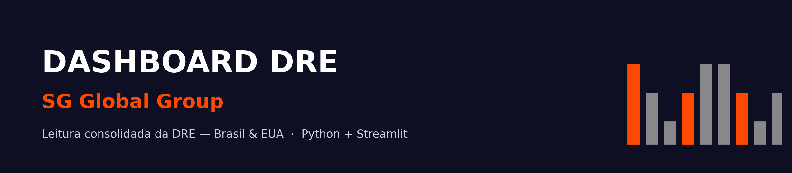
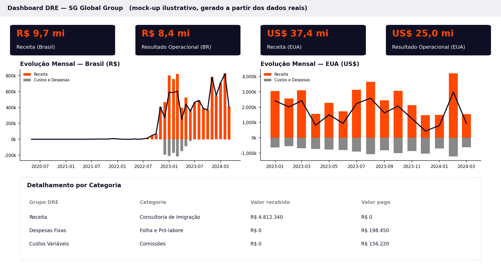
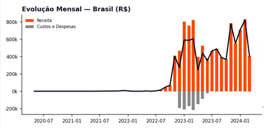
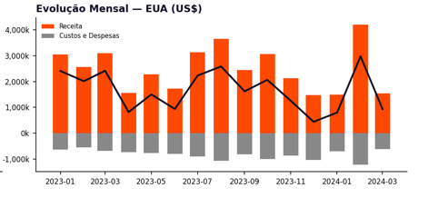
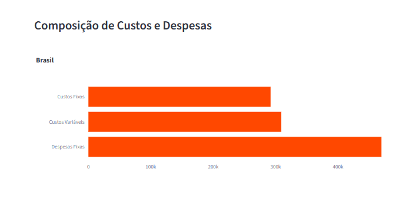
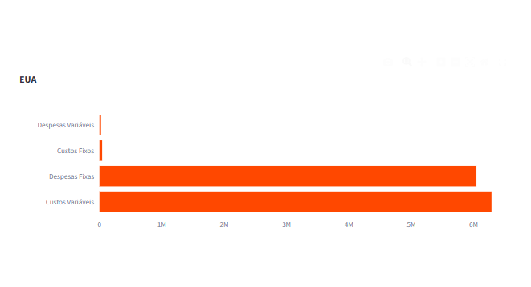
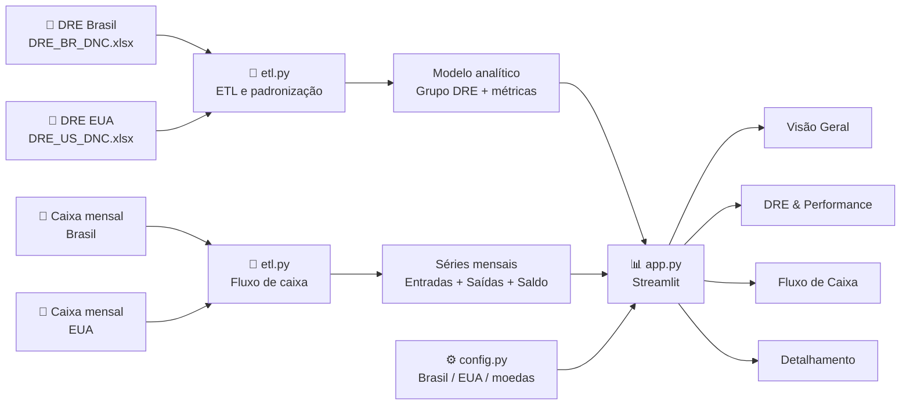

<div align="center">



<br/>

[](https://www.python.org/)
[](https://streamlit.io/)
[](https://pandas.pydata.org/)
[]()

**Dashboard financeiro para análise consolidada da DRE da SG Global Group — Brasil e EUA.**

Projeto I · Escola de Dados · DNC

</div>

<br/>

## 📑 Sumário

- [Sobre o projeto](#-sobre-o-projeto)
- [Evolução da versão atual](#-evolução-da-versão-atual)
- [Prévia do dashboard](#-prévia-do-dashboard)
- [Funcionalidades](#-funcionalidades)
- [Arquitetura e fluxo dos dados](#-arquitetura-e-fluxo-dos-dados)
- [Estrutura do repositório](#-estrutura-do-repositório)
- [Como rodar](#-como-rodar)
- [Indicadores e premissas](#-indicadores-e-premissas)
- [Qualidade e limitações dos dados](#-qualidade-e-limitações-dos-dados)
- [Roadmap](#-roadmap)
- [Autoria](#-autoria)

<br/>

## 📊 Sobre o projeto

A **SG Global Group** é uma agência de imigração fundada em 2014. Este projeto nasceu de um desafio de dados: transformar lançamentos financeiros distribuídos em duas bases — **Brasil** e **EUA** — em uma visão executiva que facilite a leitura da Demonstração do Resultado do Exercício (DRE) e do fluxo de caixa.

O dashboard realiza o processo de **limpeza, padronização, cálculo dos indicadores e visualização** usando Python, pandas, Plotly e Streamlit.

A solução preserva as moedas originais de cada operação:

- **Brasil** → R$
- **EUA** → US$

Não há conversão cambial automática. Portanto, valores nominais de Brasil e EUA não são comparados diretamente como se estivessem na mesma moeda; a comparação executiva prioriza indicadores relativos, como margens e desempenho operacional.

> 💡 O projeto foi desenvolvido com foco em transformar dados brutos em informação útil para decisão, mantendo explícitas as premissas e limitações da base.

<br/>

## 🔄 Evolução da versão atual

A versão de refinamento `feature/refinamento-dre-v3` introduz uma camada mais organizada para a análise financeira e para a apresentação dos mercados.

### Principais melhorias

- **Padronização dos mercados:** a interface utiliza somente **Brasil** e **EUA**.
- **Configuração centralizada:** país, código, moeda e elementos de apresentação ficam concentrados em `config.py`.
- **KPIs financeiros revisados:** separação entre Receita Bruta, Devoluções, Receita Líquida, Custos, Despesas, Resultado Operacional e Resultado Líquido.
- **Margens mais claras:** Margem Operacional e Margem Líquida passam a ser tratadas separadamente.
- **EBITDA identificado como proxy:** a base não possui detalhamento suficiente para um EBITDA contábil estrito.
- **Comparação internacional mais responsável:** Brasil e EUA são mantidos em suas moedas originais e indicadores relativos são priorizados para comparação.
- **ETL separado da apresentação:** o tratamento e as regras de negócio permanecem concentrados em `etl.py`, enquanto `app.py` cuida da interface.
- **Cache de dados:** carregamentos das bases são armazenados em cache pelo Streamlit para reduzir processamento repetitivo.
- **Responsividade:** a interface possui ajustes específicos para telas menores.

> A branch de refinamento preserva a `main` durante a evolução do projeto, permitindo validar as alterações antes da consolidação da versão principal.

<br/>

## 🖼 Prévia do dashboard

<details open>
<summary><strong>Visão Geral</strong> — indicadores executivos para Brasil e EUA</summary>
<br/>



<sub>⚠️ A imagem acima é um mock-up baseado nos dados e cálculos do projeto. Pode ser substituída posteriormente por uma captura real da aplicação.</sub>

</details>

<br/>

<table>
<tr>
<td width="50%">

**Evolução Mensal — Brasil**



</td>
<td width="50%">

**Evolução Mensal — EUA**



</td>
</tr>
<tr>
<td width="50%">

**Composição de Custos — Brasil**



</td>
<td width="50%">

**Composição de Custos — EUA**



</td>
</tr>
</table>

<br/>

## ✨ Funcionalidades

| | |
|---|---|
| 🌎 **Brasil e EUA** | Operações analisadas lado a lado, cada uma em sua moeda original |
| 💰 **DRE** | Receita Bruta, Devoluções, Receita Líquida, Custos, Despesas, Impostos e resultados |
| 📈 **Performance** | Evolução mensal, Margem Operacional, Margem Líquida e Margem de Contribuição |
| 🧮 **EBITDA proxy** | Indicador operacional aproximado, explicitamente identificado como proxy |
| 🏦 **Fluxo de Caixa** | Entradas, Saídas, Net Cash, Saldo, Burn Rate e Runway quando há movimentação real |
| 🧭 **Filtros dinâmicos** | Empresas e período de competência |
| 🔎 **Detalhamento** | Exploração dos lançamentos por grupo, categoria e demais dimensões disponíveis |
| ⚠️ **Transparência** | Indicadores dependentes de dados ausentes ou insuficientes são sinalizados em vez de inventados |
| 📱 **Responsividade** | Layout adaptado para diferentes larguras de tela |

<br/>

## 🏗 Arquitetura e fluxo dos dados



### Camadas principais

**`etl.py` — Dados e regras de negócio**

Responsável por:

- leitura das planilhas;
- seleção das colunas necessárias;
- limpeza de datas e valores;
- padronização das classificações;
- criação do `Grupo DRE`;
- criação das dimensões temporais;
- cálculo dos KPIs;
- preparação do fluxo de caixa.

**`config.py` — Configuração de apresentação**

Centraliza os mercados e suas propriedades:

```text
Brasil → BR → R$
EUA    → US → US$
```

A interface utiliza os nomes de apresentação **Brasil** e **EUA**.

**`app.py` — Camada de apresentação**

Responsável por:

- interface Streamlit;
- filtros;
- cards de indicadores;
- gráficos Plotly;
- mensagens executivas;
- navegação entre as áreas do dashboard.

<br/>

## 🗂 Estrutura do repositório

```text
dre_dashboard/
├── app.py                      # Interface Streamlit
├── etl.py                      # ETL, padronização e métricas
├── config.py                   # Configuração de Brasil, EUA e moedas
├── gerar_graficos.py           # Script auxiliar para gráficos estáticos
├── requirements.txt            # Dependências
├── README.md                   # Documentação
├── data/
│   ├── DRE_BR_DNC.xlsx
│   └── DRE_US_DNC.xlsx
└── docs/
    └── screenshots/            # Imagens usadas na documentação
```

<br/>

## 🚀 Como rodar

### 1. Pré-requisitos

- Python 3.10 ou superior
- Git
- Terminal (PowerShell, cmd ou bash)

### 2. Clonar o projeto

```bash
git clone https://github.com/AdrianoJesusDeveloper/Dashboard_de_DRE_SG-Global_Group_DNC.git
cd Dashboard_de_DRE_SG-Global_Group_DNC
```

### 3. Criar ambiente virtual

```bash
python -m venv venv
```

No Windows:

```bash
venv\Scripts\activate
```

No macOS/Linux:

```bash
source venv/bin/activate
```

### 4. Instalar dependências

```bash
pip install -r requirements.txt
```

### 5. Executar

```bash
streamlit run app.py
```

A aplicação será disponibilizada normalmente em `http://localhost:8501`.

Na execução padrão, o dashboard utiliza:

```text
data/DRE_BR_DNC.xlsx
data/DRE_US_DNC.xlsx
```

Também é possível utilizar o modo de envio manual de arquivos pela interface.

<br/>

## 🧮 Indicadores e premissas

| Indicador | Definição | Observação |
|---|---|---|
| Receita Bruta | Soma de `Valor recebido` classificado como Receita | Base original |
| Devoluções | Soma de valores classificados como Devolução | Tratadas separadamente quando disponíveis |
| Receita Líquida | Receita Bruta − Devoluções | Depende da existência de devoluções na base |
| Custos | Custos Variáveis + Custos Fixos | Valores pagos |
| Despesas | Despesas Fixas + Despesas Variáveis | Valores pagos |
| Resultado Operacional | Receita Líquida − Custos − Despesas | Antes dos impostos |
| Resultado Líquido | Resultado Operacional − Impostos | Conforme as categorias disponíveis |
| Margem Operacional | Resultado Operacional / Receita Líquida | Indicador relativo para comparação |
| Margem de Contribuição | (Receita Líquida − Custos Variáveis) / Receita Líquida | — |
| EBITDA (proxy) | Receita Líquida − Custos − Despesas | Não é EBITDA contábil estrito |
| Net Cash | Entradas − Saídas | Aba `Caixa mensal` |
| Burn Rate médio | Média do valor negativo de Net Cash nos meses de queima | Só calculado quando existe movimentação |
| Runway | Saldo Atual / Burn Rate médio | Estimativa em meses |

### ⚠️ Por que o EBITDA é um proxy?

A base fornecida não apresenta, de forma separada e confiável, todas as informações necessárias para um EBITDA contábil estrito, especialmente depreciação e amortização.

Por isso, o dashboard utiliza a expressão **EBITDA (proxy)** e documenta a premissa, evitando apresentar uma estimativa operacional como se fosse um indicador contábil auditado.

<br/>

## 🔍 Qualidade e limitações dos dados

Uma parte importante do projeto é identificar limitações da fonte antes de gerar indicadores.

### Tratamento realizado

- Colunas calculadas problemáticas da planilha original não são utilizadas quando podem ser recalculadas a partir dos dados brutos.
- Datas são convertidas com tratamento de valores inválidos.
- Valores financeiros são convertidos para numérico, tratando erros residuais.
- Classificações diferentes entre as bases são agrupadas em uma taxonomia comum de DRE.
- Dados são preparados para análise mensal por meio de `Ano`, `Mes` e `AnoMes`.

### Limitações conhecidas

- **Caixa do Brasil:** a aba `Caixa mensal` não apresenta movimentação real suficiente para sustentar Burn Rate e Runway.
- **Squad:** a coluna disponível não possui variação suficiente para uma análise confiável por equipe.
- **Orçado:** a base fornecida não disponibiliza dados suficientes para uma comparação completa entre Orçado e Realizado.
- **Despesas:** margens muito elevadas podem indicar que determinadas despesas operacionais não estão completamente representadas na fonte.
- **Moedas:** Brasil e EUA permanecem em R$ e US$. Não há conversão cambial automática.

> **Princípio do projeto:** quando a base não suporta uma conclusão confiável, o dashboard deve sinalizar a limitação em vez de criar uma falsa precisão.

<br/>

## 🛣 Roadmap

### Concluído

- [x] Limpeza e padronização das bases Brasil e EUA
- [x] Taxonomia comum de grupos da DRE
- [x] KPIs principais
- [x] Receita Bruta e Receita Líquida
- [x] Margem Operacional e Margem Líquida
- [x] Margem de Contribuição
- [x] EBITDA identificado como proxy
- [x] Fluxo de Caixa
- [x] Filtros por empresa e período
- [x] Padronização da apresentação como **Brasil** e **EUA**
- [x] Configuração centralizada em `config.py`
- [x] Melhorias de responsividade

### Próximas etapas

- [ ] Criar testes automatizados para as métricas financeiras
- [ ] Criar camada formal de Data Quality
- [ ] Melhorar filtros e seleção de períodos
- [ ] Refinar UX mobile
- [ ] Comparação Orçado x Realizado quando houver dados confiáveis
- [ ] Segmentação por Squad quando houver dados confiáveis
- [ ] Deploy público no Streamlit Community Cloud
- [ ] Autenticação para acesso restrito

<br/>

## 🎯 Objetivo profissional do projeto

Além de atender ao desafio da DNC, este projeto representa uma aplicação prática de competências de:

- **Python**
- **Pandas**
- **ETL**
- **Análise exploratória de dados**
- **Indicadores financeiros**
- **Visualização de dados**
- **Streamlit**
- **Plotly**
- **Qualidade de dados**
- **Pensamento analítico orientado à decisão**

A proposta é demonstrar não apenas a capacidade de criar gráficos, mas o processo completo de **transformar dados brutos em informação confiável para tomada de decisão**.

<br/>

## 👤 Autoria

**Adriano Jesus da Costa**  
Projeto I — Escola de Dados — DNC

[](https://github.com/AdrianoJesusDeveloper)

<br/>

<sub>Construído com Python, pandas, Plotly e Streamlit.</sub>

</div>
