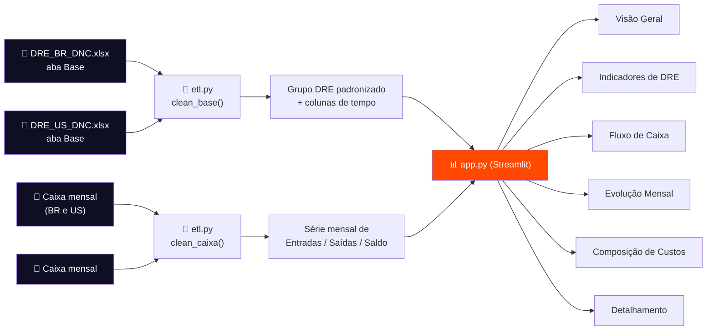

<div align="center">


<br/>

[](https://www.python.org/)
[](https://streamlit.io/)
[](https://pandas.pydata.org/)
[]()

**Leitura consolidada da DRE da SG Global Group — Brasil 🇧🇷 e EUA 🇺🇸, lado a lado, em um único dashboard.**

Projeto I · Escola de Dados · DNC

</div>

<br/>

## 📑 Sumário

- [Sobre o projeto](#-sobre-o-projeto)
- [Prévia do dashboard](#-prévia-do-dashboard)
- [Funcionalidades](#-funcionalidades)
- [Como os dados fluem](#-como-os-dados-fluem)
- [Estrutura do repositório](#-estrutura-do-repositório)
- [Como rodar](#-como-rodar)
- [Indicadores calculados](#-indicadores-calculados)
- [Limitações conhecidas dos dados](#-limitações-conhecidas-dos-dados)
- [Roadmap](#-roadmap)
- [Autoria](#-autoria)

<br/>

## 📊 Sobre o projeto

A **SG Global Group** é uma agência de imigração fundada em 2014, referência na América Latina, com mais de 5.000 famílias brasileiras assessoradas. Este projeto nasceu de uma dor concreta: os dados financeiros da empresa existem, mas ficam dispersos em **~50 mil lançamentos** espalhados por duas planilhas (Brasil e EUA), sem uma leitura consolidada para a Diretoria.

Este dashboard resolve isso: **limpa, padroniza e visualiza** a Demonstração do Resultado do Exercício (DRE) das duas operações, lado a lado, em suas moedas originais — sem precisar abrir uma única planilha.

> 💡 Construído com **Python (pandas)** para o tratamento dos dados e **Streamlit** para a interface — sem depender de ferramentas de BI proprietárias.

<br/>

## 🖼 Prévia do dashboard

<details open>
<summary><strong>Visão Geral</strong> — KPIs, evolução mensal e detalhamento, Brasil e EUA lado a lado</summary>
<br/>


<sub>⚠️ Esta imagem é um <strong>mock-up gerado a partir dos dados reais e dos mesmos cálculos do dashboard</strong> — não é um print literal da tela do Streamlit. Depois de rodar o app na sua máquina (veja <a href="#-como-rodar">Como rodar</a>), você pode substituir esta imagem por um print real em <code>docs/screenshots/</code>.</sub>

</details>

<br/>

<table>
<tr>
<td width="50%">

**Evolução Mensal — Brasil**


</td>
<td width="50%">

**Evolução Mensal — EUA**


</td>
</tr>
<tr>
<td width="50%">

**Composição de Custos — Brasil**


</td>
<td width="50%">

**Composição de Custos — EUA**


</td>
</tr>
</table>

<details>
<summary>💵 Ver também: <strong>Fluxo de Caixa Mensal (EUA)</strong></summary>
<br/>


<sub>O Brasil não aparece aqui porque a aba <code>Caixa mensal</code> dessa base não tem movimentação real registrada — ver <a href="#-limitações-conhecidas-dos-dados">Limitações conhecidas dos dados</a>.</sub>

</details>

<br/>

## ✨ Funcionalidades

| | |
|---|---|
| 🌎 **Brasil + EUA lado a lado** | Duas bases, duas moedas (R$ / US$), sem conversão forçada — comparação estrutural, não nominal |
| 💰 **KPIs de DRE** | Receita, Custos, Despesas, Impostos, Resultado Operacional e Margem |
| 📈 **Indicadores avançados** | Receita Bruta/Líquida, Margem de Contribuição, EBITDA (aproximado), Margem Líquida |
| 🏦 **Fluxo de Caixa** | Saldo Atual, Burn Rate médio e Runway, com gráfico de Entradas x Saídas x Saldo |
| 🧭 **Filtros dinâmicos** | Empresa e período de competência, aplicados a todos os gráficos ao mesmo tempo |
| 🔍 **Detalhamento** | Tabela navegável por Grupo DRE e Categoria |
| ⚠️ **Transparência de dados** | O app avisa quando um indicador não pode ser calculado com confiança, em vez de mostrar número inventado |

<br/>

## 🔄 Como os dados fluem



<sub>Diagrama renderizado automaticamente pelo GitHub (Mermaid). Se estiver lendo isso fora do GitHub, ele aparece como texto — abra o repositório no navegador para ver o fluxo visual.</sub>

<br/>

## 🗂 Estrutura do repositório

```
dre_dashboard/
├── app.py                      # Aplicativo Streamlit — a interface do dashboard
├── etl.py                      # Limpeza, padronização e cálculo dos indicadores
├── gerar_graficos.py           # Script auxiliar para exportar gráficos estáticos (PNG)
├── requirements.txt            # Dependências do projeto
├── README.md                   # Este arquivo
├── data/
│   ├── DRE_BR_DNC.xlsx
│   └── DRE_US_DNC.xlsx
└── docs/
    └── screenshots/            # Imagens usadas neste README
```

<br/>

## 🚀 Como rodar

<details open>
<summary><strong>1. Pré-requisitos</strong></summary>
<br/>

- Python 3.10 ou superior instalado
- Terminal (cmd, PowerShell ou bash)

</details>

<details open>
<summary><strong>2. Instalação</strong></summary>
<br/>

```bash
# Entre na pasta do projeto
cd dre_dashboard

# Crie um ambiente virtual (recomendado)
python -m venv venv

# Ative o ambiente virtual
# Windows:
venv\Scripts\activate
# Mac/Linux:
source venv/bin/activate

# Instale as dependências
pip install -r requirements.txt
```

</details>

<details open>
<summary><strong>3. Execução</strong></summary>
<br/>

```bash
streamlit run app.py
```

O navegador abre automaticamente em **http://localhost:8501**. Na barra lateral, deixe selecionado **"Usar arquivos padrão (./data)"** — os arquivos já estão na pasta `data/`.

</details>

<details>
<summary><strong>Problemas comuns</strong> (clique para expandir)</summary>
<br/>

| Sintoma | Provável causa | Solução |
|---|---|---|
| `streamlit: command not found` | Ambiente virtual não ativado ou dependências não instaladas | Repita o passo 2, confirme que o `venv` está ativo (aparece `(venv)` no terminal) |
| Página em branco / erro ao carregar dados | Arquivos `.xlsx` não estão em `data/` | Confirme que `DRE_BR_DNC.xlsx` e `DRE_US_DNC.xlsx` estão dentro de `dre_dashboard/data/` |
| Gráficos não aparecem | Versão do `plotly` desatualizada | `pip install --upgrade plotly` |

</details>

<br/>

## 🧮 Indicadores calculados

<details>
<summary><strong>Ver fórmulas e definições</strong> (clique para expandir)</summary>
<br/>

| Indicador | Fórmula | Observação |
|---|---|---|
| Receita Bruta | Σ Valor recebido classificado como "Receita" | — |
| Receita Líquida | Receita Bruta − Devoluções | Devoluções só existem na base US |
| Margem de Contribuição | (Receita Líquida − Custos Variáveis) / Receita Líquida | — |
| EBITDA (aproximado) | Receita Líquida − Custos Variáveis − Custos Fixos − Despesas | Proxy operacional; a Base não separa depreciação/amortização |
| Resultado Operacional | Receita − Custos − Despesas − Impostos | — |
| Margem Líquida | Resultado Líquido / Receita Líquida | — |
| Net Cash (mensal) | Entradas − Saídas | Aba `Caixa mensal` |
| Burn Rate médio | Média do \|Net Cash\| nos meses em que ele foi negativo | Só calculado quando há movimentação real |
| Runway | Saldo Atual / Burn Rate médio | Em meses |

</details>

<br/>

## ⚠️ Limitações conhecidas dos dados

Nem tudo que os dados sugerem à primeira vista é confiável — parte do valor deste projeto foi *identificar* isso, não escondê-lo:

- **Colunas calculadas da planilha original** (`Valor Original Ajustado`, `Atrasado` etc.) retornam erro de fórmula em parte das linhas — não são usadas; tudo é recalculado a partir dos dados brutos.
- **`Caixa mensal` do Brasil não tem Entradas/Saídas reais** — fica zerada em 100% das linhas, só repetindo um saldo estático. Burn Rate e Runway só existem para os EUA.
- **A coluna `Squad`** só contém um único valor fixo em todas as linhas — não permite segmentação real por equipe/projeto.
- **A coluna `Orçado`** só contém `"Realizado"`, em ambas as abas — não há comparação Orçado x Realizado disponível nos dados fornecidos.
- **Margem operacional muito alta** em ambas as bases (Brasil ~86%, EUA ~67%) — possível indício de que despesas como folha de pagamento não estão totalmente capturadas nesta base.

<br/>

## 🛣 Roadmap

- [x] Limpeza e padronização das bases BR e US
- [x] KPIs principais de DRE (Receita, Custos, Despesas, Resultado, Margem)
- [x] Indicadores avançados (EBITDA aprox., Margem de Contribuição)
- [x] Módulo de Fluxo de Caixa
- [ ] Comparação Orçado x Realizado (pendente de fonte de dados)
- [ ] Segmentação real por Squad/equipe (pendente de dados da empresa)
- [ ] Publicação no Streamlit Community Cloud
- [ ] Autenticação simples para acesso restrito da equipe

<br/>

## 👤 Autoria

**Adriano Jesus da Costa**
Projeto I — Escola de Dados — DNC

<sub>Construído com Python, pandas e Streamlit.</sub>

</div>
